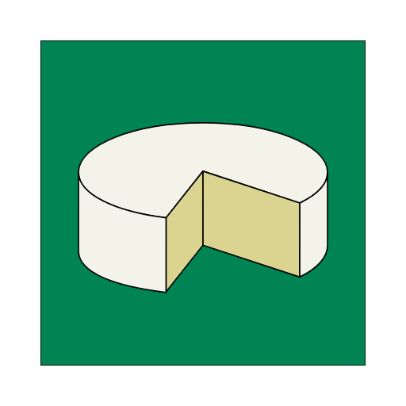
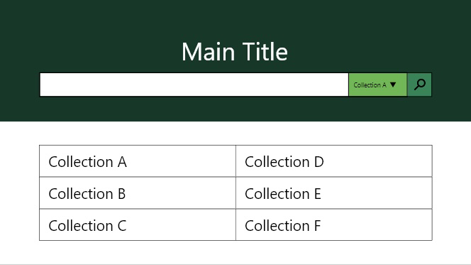
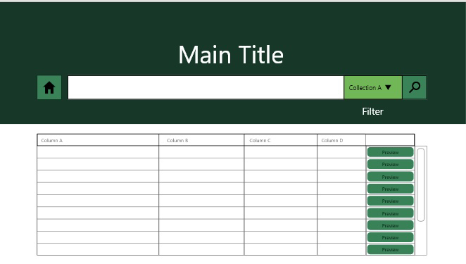
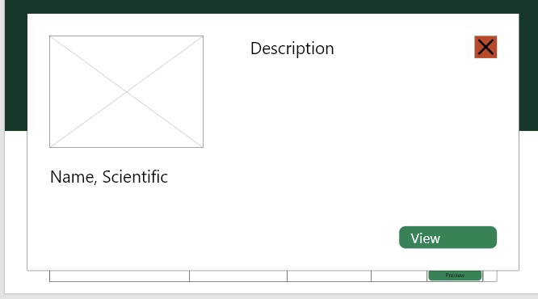
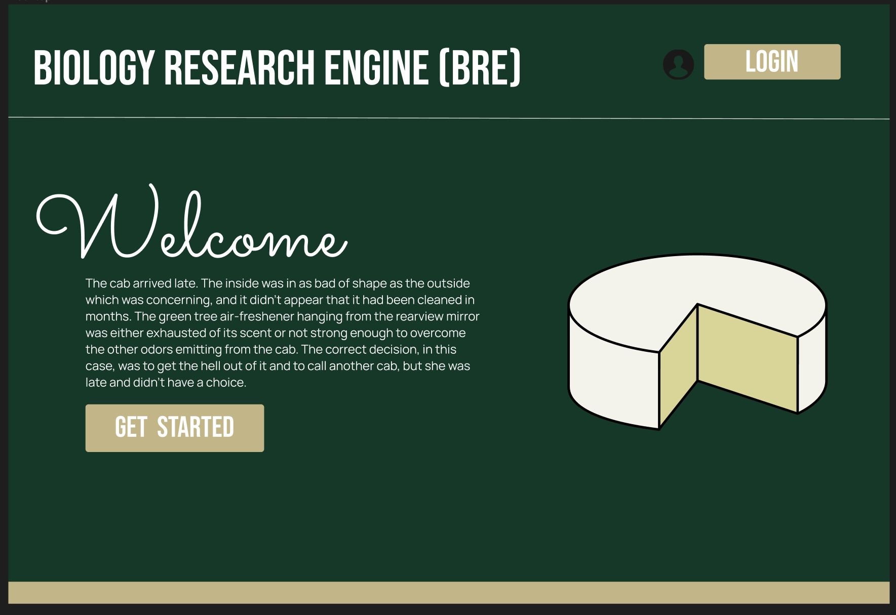
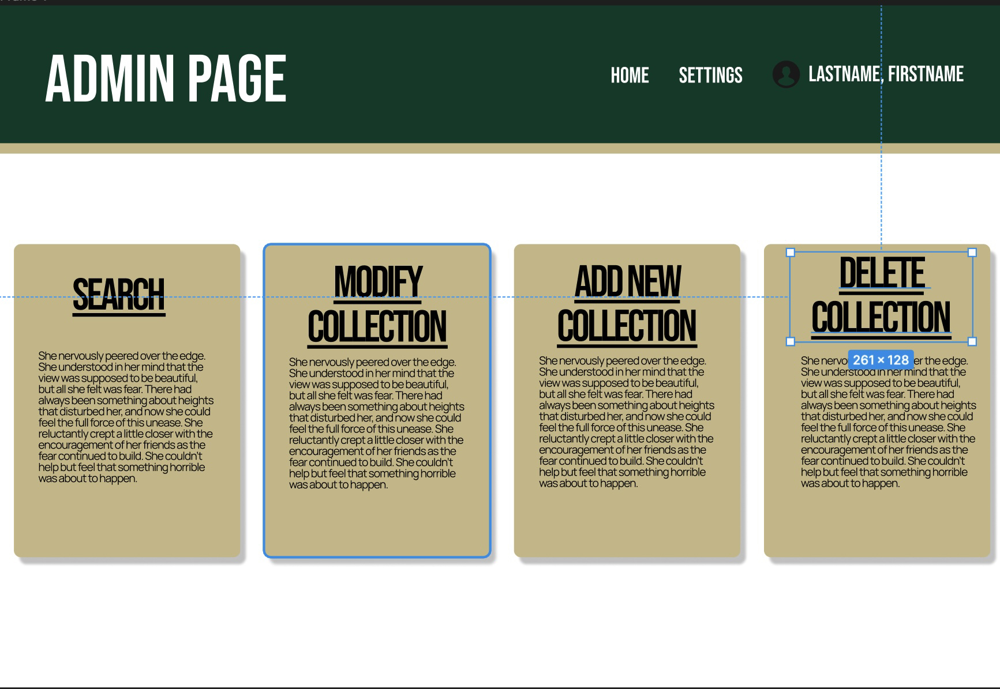
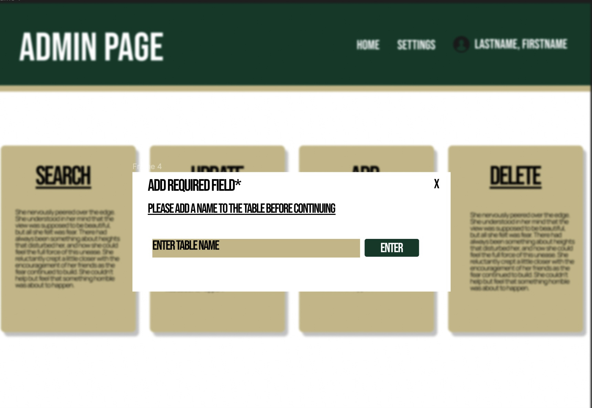

# Sacramento State Biology Collections

    

- [Brian Almaguer](https://github.com/BalmaBrian)
  - **Email:** Balmaguer@csus.edu
- [Joseph May](https://github.com/jo3y49)
  - **Email:** Josephmay@csus.edu
- [Lauren Prather](https://github.com/lprather)
  - **Email:** Lprather@csus.edu
- [Ivan Yuen](https://github.com/IvanYuen711)
  - **Email:** IvanYuen@csus.edu
- [Kelly Bringino](https://https://github.com/KellyJBringino)
  - **Email:** KellyBringino@csus.edu
- [Leonardo Anguiano](https://github.com/languiano805)
  - **Email:** LAnguiano@csus.edu
- [Tawheed Bayaz](https://github.com/TawheedB)
  - **Email:** TawheedBayaz@csus.edu
- [Evan Boswell](https://github.com/EvanBoswell)
  - **Email:** eboswell2@csus.edu
- [Lukas Dolansky](https://github.com/LukasDolansky)
  - **Email:** LukasDolansky@csus.edu

## Background:

---

Biology Department at Sacramento State University - At CSU Sacramento they have ~7000 collections and they have to manage them digitally. They asked us to create a PWA application that will allow them to catalog search up and share there resources more effectively.

## Solution:

---

Creating a website that can turn into an application and run on the user device which allows them to interact with the Biology Collections according to there needs and clearance.

## Prototypes:

---

    
    
    
    
    
    

## Timeline:

---

Sprint0-Project Preparation: Our team created meeting times based on each other schedules. We met with client to discuss project requiremets and to fill out the project proposal. Acquired the mammals database from the client.

Sprint1: We set up jira and started creat

Sprint2: We started discussing how to implement indexdb and service workers as well as clean the database. We made mockups. 

Sprint3: We completed our MVP. We began implementing the service worker.

Sprint4: We created the mockups for the login page and admin page. We began moving BRE to a server.

Future:

Sprint5:
Part 1 of CRUD implimentation
Begin implimenting the additional features to make the application match the CRUD functionality requirements. Currently we are able to search, but this upcoming semester we are going to add the ability to create, update, and delete data and tables. Add the mock ups to the website and make them semi functional.

Sprint6:
Coninue adding CRUD functionality to finalize and enable everything to make the site match CRUD functionality

Sprint7:
Add sercuity systems, and verification for users so that only authourized personel have the ability to edit the data in any capacity.
Sprint8:
Add pictures ontop of the the systems in place to support images of specimen. This means that we need to be able to CRUD images and store them as well and impliment the optional download of images.
Sprint9:
Finally, adding the abil

## Testing:

---

## Deployment:

___

## Developer's Instructions:

---